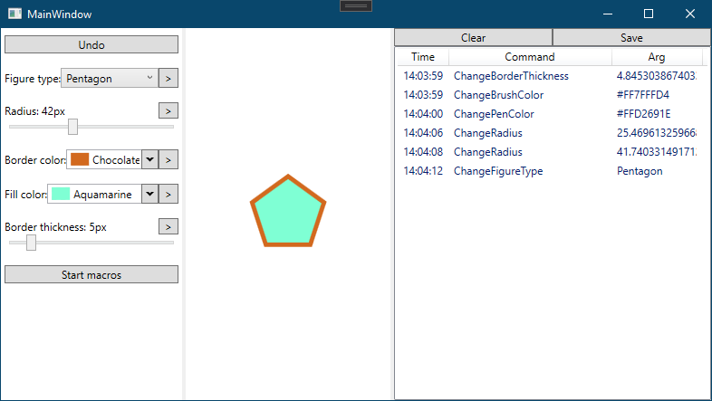

# Лабораторная № 1
Реализовать приложение, предоставляющее фабрику по производству продукции (вид продукции – на свой выбор, не менее 5 вариантов; классы конкретных продуктов должны реализовывать паттерн **“мост”**). Продукты должны выпускаться **“абстрактной фабрикой”**, являющейся **“одиночкой”**. Созданием объектов на фабрике занимается паттерн **“строитель”**, реализованный через паттерн **“мост”** (**“директор”** является абстракцией, а “строители” – реализациями). Продемонстрировать работу фабрики. 

# Лабораторная № 2
Реализовать оконное приложение, позволяющее модифицировать параметры фигуры: 
* тип (круг, правильный треугольник, квадрат, правильный пятиугольник, правильный шестиугольник), 
* размер (расстояние от центра масс до вершины – в пределах от 5 до 100 пикселей), 
* цвет границы, 
* цвет заливки, 
* толщину границы (в пределах от 1 до 30 пикселей). 

Каждое действие должно представлять собой объект, реализующий паттерн **“команда”**. Реализовать возможность записи макрокоманд (максимум – 5 действий) с возможностью последующего исполнения. Все действия (в том числе и макрокоманда) должны быть отменяемыми (паттерн **“хранитель”**). Действия над фигурой должны сохраняться в журнал действий при помощи применения паттерна **“заместитель”**. Журнал действий должен отображаться в пользовательском интерфейсе; реализовать опции очистки журнала и сохранения журнала в файл.

## Внешний вид программы:

# Лабораторная № 3
Реализовать приложение для сортировки массивов данных. Алгоритмы сортировки (*bubbleSort*, *insertionSort*, *selectionSort*, *mergeSort*, *heapSort*, *quickSort*) должны быть представлены в виде классов, реализующих паттерн **“стратегия”**. Данные в массиве могут быть любого типа. В рамках процесса можно выполнить несколько различных сортировок массива (объект, хранящий массив, должен реализовывать паттерн **“прототип”**). Сортировать данные можно по возрастанию/убыванию. В качестве параметров для создания объектов “стратегий” передаются селектор ключа (поле или набор полей, по которому (-ым) производится сортировка) и правило нахождения отношения порядка между ключами (делегат или объект, реализующий интерфейс IComparer). 

# Лабораторная № 4
Реализовать шаблонный валидатор на основе паттерна **“цепочка обязанностей”**. Создание валидатора (добавление правил в цепочку) реализовать при помощи паттерна **“строитель”**. Метод для добавления правил в цепочку должен принимать на вход делегат, в котором определяется, над чем производить валидацию (селектор) и предикат для валидируемых данных. При непройденной валидации должна генерироваться исключительная ситуация. Продемонстрировать работу валидатора. 